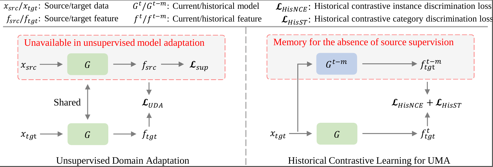

# Model Adaptation: Historical Contrastive Learning for Unsupervised Domain Adaptation without Source Data

### Updates

## Paper

[Model Adaptation: Historical Contrastive Learning for Unsupervised Domain Adaptation without Source Data](https://papers.nips.cc/paper/2021/file/1dba5eed8838571e1c80af145184e515-Paper.pdf)  
 [Jiaxing Huang](https://scholar.google.com/citations?user=czirNcwAAAAJ&hl=en&oi=ao), [Dayan Guan](https://scholar.google.com/citations?user=9jp9QAsAAAAJ&hl=en), [Xiao Aoran](https://scholar.google.com/citations?user=yGKsEpAAAAAJ&hl=en), [Shijian Lu](https://scholar.google.com/citations?user=uYmK-A0AAAAJ&hl=en)  
 School of Computer Science Engineering, Nanyang Technological University, Singapore  
 Thirty-fifth Conference on Neural Information Processing Systems.
 
If you find this code/paper useful for your research, please cite our [paper](https://papers.nips.cc/paper/2021/file/1dba5eed8838571e1c80af145184e515-Paper.pdf):

```
@inproceedings{huang2021model,
  title={Model adaptation: Historical contrastive learning for unsupervised domain adaptation without source data},
  author={Huang, Jiaxing and Guan, Dayan and Xiao, Aoran and Lu, Shijian},
  booktitle={Thirty-Fifth Conference on Neural Information Processing Systems},
  year={2021}
}

```

## Abstract

Unsupervised domain adaptation aims to align a labeled source domain and an unlabeled target domain, but it requires to access the source data which often raises concerns in data privacy, data portability and data transmission efficiency. We study unsupervised model adaptation (UMA), or called Unsupervised Domain Adaptation without Source Data, an alternative setting that aims to adapt source-trained models towards target distributions without accessing source data. To this end, we design an innovative historical contrastive learning (HCL) technique that exploits historical source hypothesis to make up for the absence of source data in UMA. HCL addresses the UMA challenge from two perspectives. First, it introduces historical contrastive instance discrimination (HCID) that learns from target samples by contrasting their embeddings which are generated by the currently adapted model and the historical models. With the historical models, HCID encourages UMA to learn instance-discriminative target representations while preserving the source hypothesis. Second, it introduces historical contrastive category discrimination (HCCD) that pseudo-labels target samples to learn category-discriminative target representations. Specifically, HCCD re-weights pseudo labels according to their prediction consistency across the current and historical models. Extensive experiments show that HCL outperforms and state-of-the-art methods consistently across a variety of visual tasks and setups.

## Installation
1. Conda enviroment:
```bash
conda create -n hcl python=3.6
conda activate hcl
conda install -c menpo opencv
pip install torch==1.0.0 torchvision==0.2.1
```

2. Clone the [ADVENT](https://github.com/valeoai/ADVENT):
```bash
git clone https://github.com/valeoai/ADVENT.git
pip install -e ./ADVENT
```

3. Clone the repo:
```bash
https://github.com/jxhuang0508/HCL.git
pip install -e ./HCL
```

4. Install environment:
```bash
conda env create -f hcl_target.yml
```

### Prepare Dataset
* **GTA5**: Please follow the instructions [here](https://download.visinf.tu-darmstadt.de/data/from_games/) to download images and semantic segmentation annotations. The GTA5 dataset directory should have this basic structure:
```bash
HCL/data/GTA5/                               % GTA dataset root
HCL/data/GTA5/images/                        % GTA images
HCL/data/GTA5/labels/                        % Semantic segmentation labels
...
```

* **Cityscapes**: Please follow the instructions in [Cityscape](https://www.cityscapes-dataset.com/) to download the images and validation ground-truths. The Cityscapes dataset directory should have this basic structure:
```bash
HCL/data/Cityscapes/                         % Cityscapes dataset root
HCL/data/Cityscapes/leftImg8bit              % Cityscapes images
HCL/data/Cityscapes/leftImg8bit/val
HCL/data/Cityscapes/gtFine                   % Semantic segmentation labels
HCL/data/Cityscapes/gtFine/val
...
```

### Pre-trained models
Pre-trained models can be downloaded [here](https://github.com/jxhuang0508/HCL/releases/tag/model) and put ```GTA5_HCL_source.pth``` into ```HCL/pretrained_models/HCL_source_only_426```, ```GTA5_HCL_target.pth``` into ```HCL/pretrained_models/HCL_target_482```. 

### Training
To train GTA5_HCL_source:
```bash
conda activate hcl
cd HCL/hcl/scripts
python train.py --cfg configs/hcl_source.yml
```

To evaluate trained GTA5_HCL_source:
```bash
conda activate hcl
cd HCL/hcl/scripts
python test.py --cfg configs/hcl_source.yml
```

To train GTA5_HCL_target:
```bash
conda activate hcl_target
cd HCL/hcl_target
python generate_plabel_cityscapes_advent.py  --restore-from ../../pretrained_models/GTA5_HCL_source.pth
```
```bash
conda activate hcl_target
python train_ft_advent_hcl.py --snapshot-dir ./snapshots/HCL_target \
--restore-from ../../pretrained_models/GTA5_HCL_source.pth \
--drop 0.2 --warm-up 5000 --batch-size 9 --learning-rate 1e-4 --crop-size 512,256 --lambda-seg 0.5 --lambda-adv-target1 0 \
--lambda-adv-target2 0 --lambda-me-target 0 --lambda-kl-target 0 --norm-style gn --class-balance --only-hard-label 80 \
--max-value 7 --gpu-ids 0,1,2 --often-balance  --use-se  --input-size 1280,640  --train_bn  --autoaug False --save-pred-every 300
```

To evaluate trained GTA5_HCL_target:
```bash
conda activate hcl_target
cd HCL/hcl_target
./test.sh
```

### Evaluation over Pretrained models

To evaluate GTA5_HCL_source.pth:
```bash
conda activate hcl
cd HCL/hcl/scripts
python test.py --cfg ./configs/hcl_source_pretrained.yml
```

To evaluate GTA5_HCL_target.pth:
```bash
conda activate hcl_target
cd HCL/hcl_target
python evaluate_cityscapes_advent_best.py --restore-from ../../pretrained_models/GTA5_HCL_target.pth
```

 ## Related Works
 We also would like to thank great works as follows:
 - https://github.com/valeoai/ADVENT
 - https://github.com/layumi/Seg-Uncertainty
 - https://github.com/yzou2/CRST


## Contact
If you have any questions, please contact: jiaxing.huang@ntu.edu.sg
